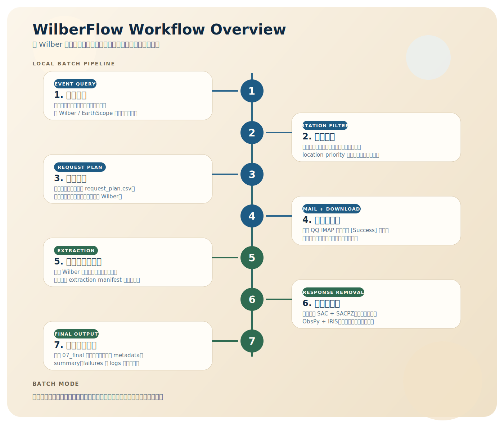
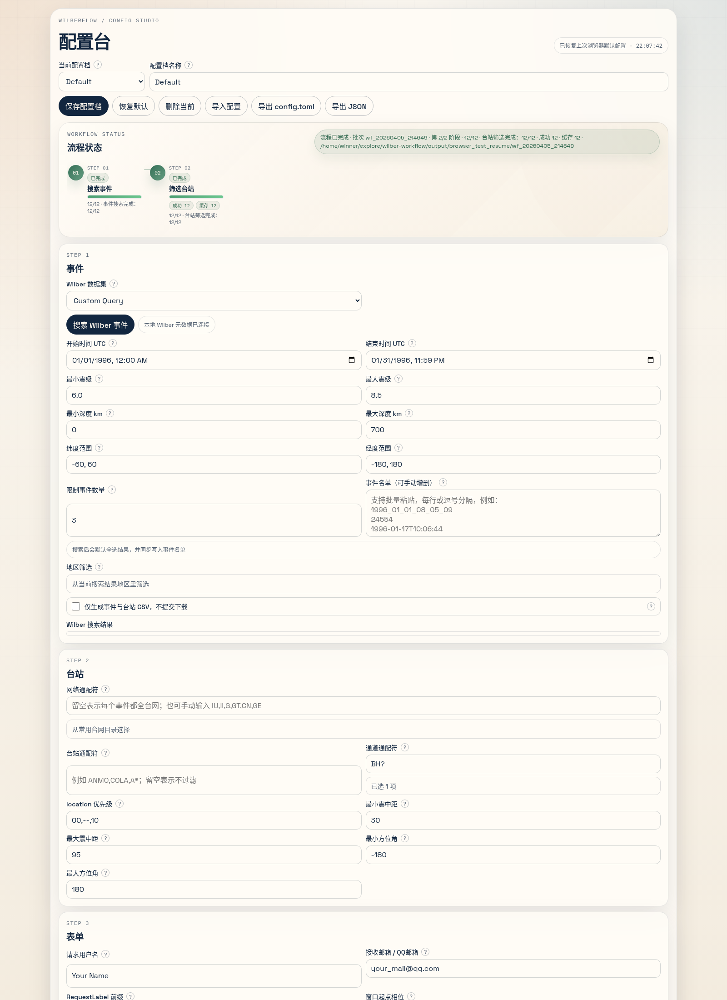
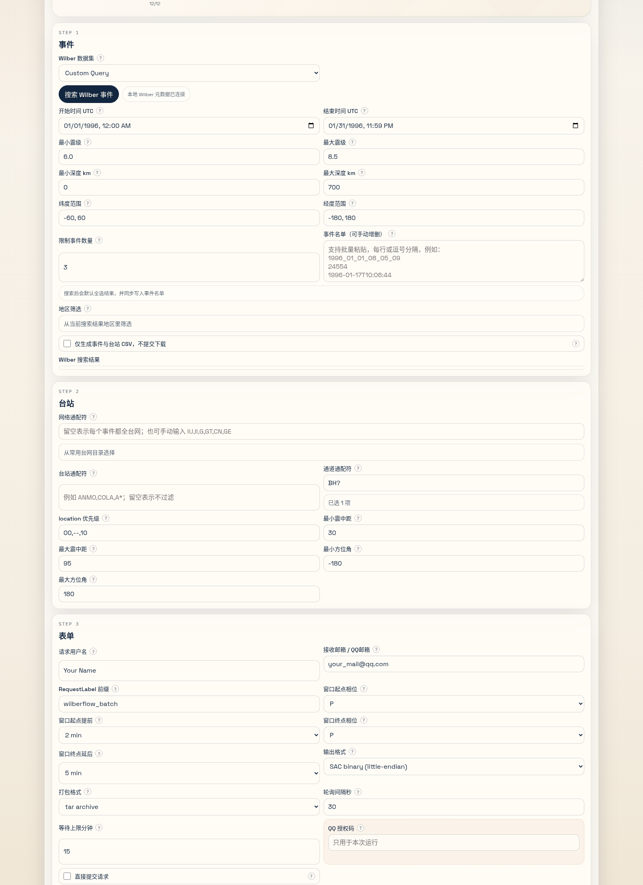
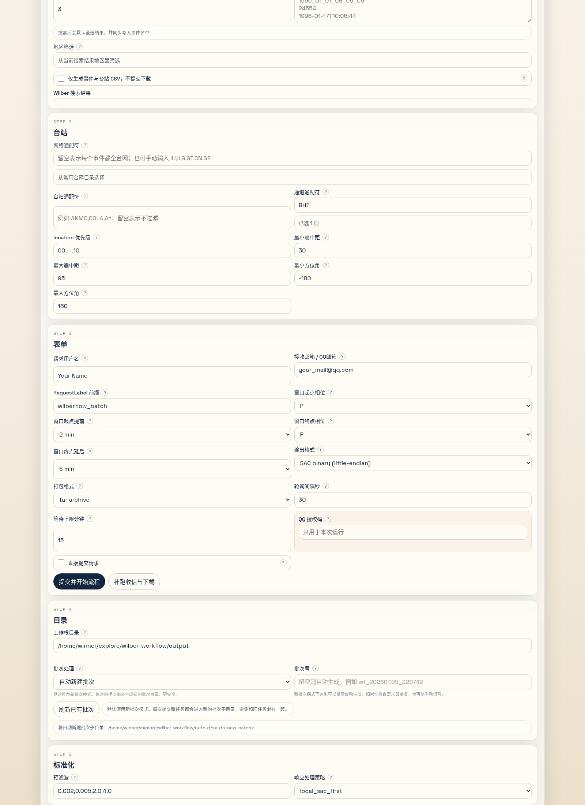
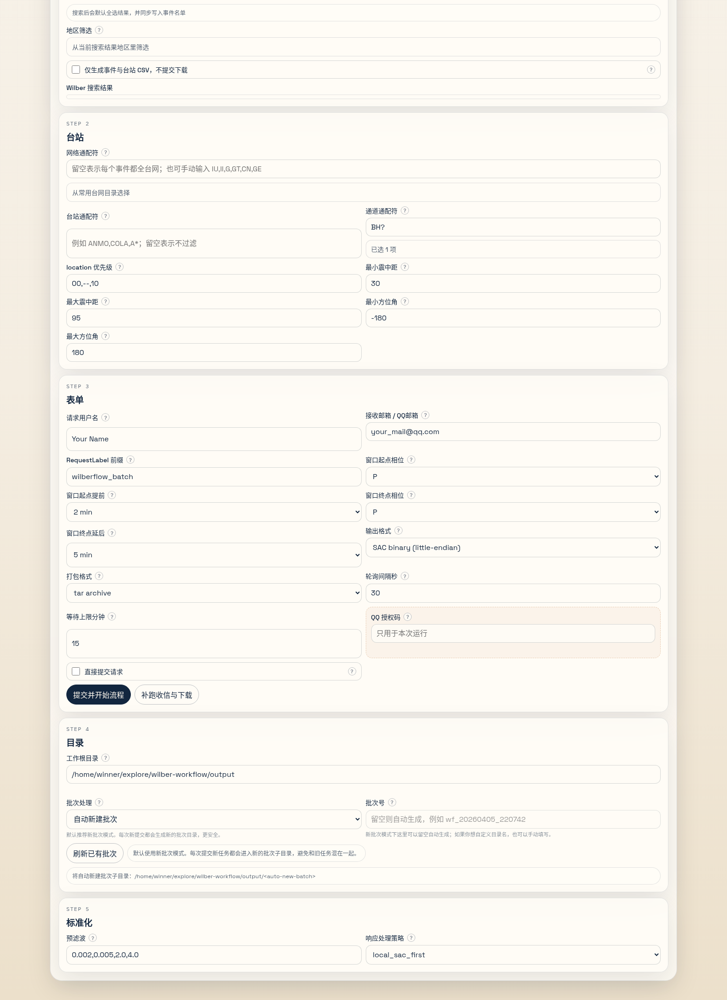

# Wilber Workflow

[](https://github.com/15236702150master/wilber-workflow/actions/workflows/ci.yml)
[](https://github.com/15236702150master/wilber-workflow/releases)
[](https://github.com/15236702150master/wilber-workflow/stargazers)
[](#依赖与工具说明)
[](#运行边界)
[](LICENSE)
[](#网页配置台怎么用)
[](#断点续跑通俗解释)

`wilber-workflow` 是一个给地震波形用户准备的本地工具：把原本需要你在 Wilber 网页上一条条手动完成的工作，整理成一个可重复、可补跑、可统计的工作流。

适合这样的场景：

- 先按时间、震级、区域等条件搜索一批 Wilber 事件。
- 再按台网、台站、通道、震中距、方位角等条件筛台站。
- 自动生成并提交 Wilber 请求。
- 自动去 QQ 邮箱里找 `[Success]` 邮件。
- 自动下载、解压、去仪器响应，并整理成最终事件目录。

项目当前定位是“本地服务 + 本地网页配置台”：

- 用户自己克隆仓库。
- 在 `WSL/Linux` 本地安装依赖。
- 用本地网页配置台填写参数。
- 一键启动本地服务，然后在浏览器里使用。

## 3-Minute Quick Start

```bash
git clone https://github.com/15236702150master/wilber-workflow.git
cd wilber-workflow
bash scripts/setup.sh
cp .env.local.example .env.local
bash scripts/start-studio.sh
```

然后在浏览器打开：

```text
http://127.0.0.1:8765
```

第一次测试推荐：

1. 先把事件数量限制到 `1` 到 `3`
2. 先勾选 `metadata only`
3. 先确认 `01_events` 和 `02_stations` 是否合理

## 适合谁用

- 已经在手动使用 Wilber，希望把重复步骤自动化的用户
- 需要批量获取事件、台站和波形文件的用户
- 希望保留中间目录、统计文件和断点续跑能力的用户
- 习惯在 `WSL/Linux` 运行工具，但想把结果写到 Windows 盘的用户

## 亮点

| 能力 | 说明 |
| --- | --- |
| 本地网页配置台 | 在浏览器里填写参数，不需要手改大量配置文件 |
| 批次目录模式 | 每次运行自动生成独立批次目录，便于管理新旧任务 |
| 事件级断点续跑 | 阶段中断后可按事件补跑，而不是整阶段重来 |
| 原始台站缓存 | 短时间内重复筛台站时，可以直接复用本地缓存 |
| 邮件轮询 | 自动检查 QQ 邮箱中的 `[Success]` 邮件 |
| 后处理一体化 | 下载、解压、去响应、整理最终事件目录都在同一条链路里 |

## 配置台预览



<table>
  <tr>
    <td></td>
    <td></td>
  </tr>
  <tr>
    <td></td>
    <td></td>
  </tr>
</table>

## 目录

- [一句话理解这个项目](#一句话理解这个项目)
- [运行边界](#运行边界)
- [功能概览](#功能概览)
- [快速开始](#快速开始)
- [依赖与工具说明](#依赖与工具说明)
- [一键命令](#一键命令)
- [仓库目录说明](#仓库目录说明)
- [输出目录怎么理解](#输出目录怎么理解)
- [批次目录模式](#批次目录模式)
- [断点续跑通俗解释](#断点续跑通俗解释)
- [网页配置台怎么用](#网页配置台怎么用)
- [示例配置](#示例配置)
- [推荐测试流程](#推荐测试流程)
- [真实案例](#真实案例)
- [CLI 用法](#cli-用法)
- [每个阶段会产出什么](#每个阶段会产出什么)
- [常见问题](#常见问题)
- [与旧脚本的关系](#与旧脚本的关系)
- [发布前检查](#发布前检查)
- [安全说明](#安全说明)
- [更新记录](#更新记录)
- [贡献](#贡献)
- [协作行为](#协作行为)
- [许可证](#许可证)

## 一句话理解这个项目

如果你以前的工作方式是：

1. 打开 Wilber。
2. 搜事件。
3. 点进事件页面。
4. 选台站和台网。
5. 填表单。
6. 去邮箱找成功邮件。
7. 下载压缩包。
8. 解压。
9. 去响应。
10. 整理成最终事件目录。

那么这个项目做的事就是：把上面这整套手工流程收成一个可配置、可补跑、可复用缓存的本地工具。

## 运行边界

当前推荐并支持的运行方式：

- 服务运行环境：`WSL/Linux`
- 浏览器：Windows 浏览器、WSL 里的浏览器、Linux 浏览器都可以，只要能打开本地地址
- 输出目录：既可以放在 Linux 路径，也可以放在 Windows 挂载路径，例如 `/mnt/d/Data/Wilber/...`

不推荐的方式：

- 纯 Windows Python 环境直接运行服务

如果用户在网页里直接填写 `D:\Data\Wilber\demo`，后端会自动换成 WSL 可用的 `/mnt/d/Data/Wilber/demo`。

## 功能概览

当前已经支持：

- Wilber 事件搜索
- 台站筛选
- Wilber 请求体生成与提交
- QQ IMAP 邮件轮询
- 数据下载与解压
- 多通道文件分别去仪器响应
- 标准化事件目录整理
- 批次目录管理
- 阶段内按事件断点续跑
- Wilber 原始台站列表本地缓存
- 前端 profile 保存
- 导出 `config.toml`
- 导入配置

## 快速开始

首次使用可以按下面 5 步完成。

### 1. 克隆仓库

```bash
git clone https://github.com/15236702150master/wilber-workflow.git
cd wilber-workflow
```

### 2. 一键安装依赖

```bash
bash scripts/setup.sh
```

这个命令会自动做几件事：

- 创建 `.venv`
- 升级 `pip`
- 安装项目依赖
- 以可编辑模式安装 `wilber-workflow`

### 3. 准备邮箱环境变量

```bash
cp .env.local.example .env.local
```

然后编辑 `.env.local`，至少填：

```bash
QQ_IMAP_USER=your_qq_mail@qq.com
QQ_IMAP_AUTH_CODE=your_mail_auth_code
```

### 4. 一键启动本地配置台

```bash
bash scripts/start-studio.sh
```

启动后浏览器打开：

```text
http://127.0.0.1:8765
```

### 5. 停止服务

```bash
bash scripts/stop-studio.sh
```

## 依赖与工具说明

推荐运行环境与依赖如下。

### 必需依赖

- `Python >= 3.11`
- `pip`
- `venv`
- `WSL/Linux`

Python 包依赖安装后会自动带上：

- `obspy`
- `numpy`

### TauP 要不要单独安装

通常不需要单独安装 `TauP`。

因为本项目用到的走时计算来自 `ObsPy` 里的 `obspy.taup`。只要 `obspy` 安装成功，TauP 这一部分就已经能用了。

### 去仪器响应需要什么

本项目支持两条路径：

1. 优先使用本机 `SAC + 本地 SACPZ`
2. 本地 `SACPZ` 不够时，自动回退到 `ObsPy + EarthScope/IRIS response`

所以：

- `SAC` 不是绝对必需，但如果你本机有 `SAC`，很多传统处理链会更顺手
- 即使本地没有合适的 `SACPZ`，项目也会尝试回退，不会像以前那样直接整批失败

### 邮箱需要什么

如果要走“提交 Wilber -> 等待 Success 邮件 -> 下载”这条链路，必须有：

- QQ 邮箱
- QQ 邮箱已开启 IMAP
- QQ 邮箱授权码

### 浏览器需要什么

只需要一个普通浏览器，能打开本地地址即可。

## 一键命令

最常用的命令如下。

### 安装环境

```bash
bash scripts/setup.sh
```

### 启动网页配置台

```bash
bash scripts/start-studio.sh
```

### 停止网页配置台

```bash
bash scripts/stop-studio.sh
```

### 发布前敏感信息检查

```bash
bash scripts/check-sensitive-files.sh
```

### 直接用 CLI 跑完整流程

```bash
source .venv/bin/activate
wilberflow run-all --config /path/to/config.toml --workspace-root /path/to/output
```

## 仓库目录说明

```text
wilber-workflow/
  CHANGELOG.md
  CODE_OF_CONDUCT.md
  CONTRIBUTING.md
  LICENSE
  SECURITY.md
  config.example.toml
  docs/
  examples/
  scripts/
  site/
  src/
  tests/
  output/
```

几个最重要的目录：

- `docs/`：发布前说明、流程图、README 配图资源
- `examples/`：示例配置和示例输出树
- `scripts/`：一键安装、启动、停止
- `site/`：本地网页配置台
- `src/wilberflow/`：真正的后端逻辑
- `output/`：默认输出根目录

## 输出目录怎么理解

用户只需要提供一个“工作根目录”。

例如：

```text
/home/you/wilber-workflow/output
```

或者：

```text
/mnt/d/Data/Wilber
```

程序不会要求你再手动创建一堆子目录，而是会自己在这个根目录下新建批次目录，例如：

```text
output/wf_20260405_214649/
```

完整示例可以看：

- [examples/demo-output-tree.txt](examples/demo-output-tree.txt)

## 批次目录模式

批次目录是这个项目的核心设计之一。

### 什么是“自动新建批次”

每次点“提交并开始流程”，都会在工作根目录下新建一个新的批次目录，例如：

```text
output/wf_20260405_214649/
output/wf_20260405_215210/
```

好处是：

- 新旧任务不会混在一起
- 更容易补跑
- 更容易看日志和中间文件

### 什么是“继续已有批次”

当你已经跑过一半，或者邮件晚到了，不想重新提交事件时，就用“继续已有批次”。

这时你需要指定旧批次号，例如：

```text
wf_20260405_214649
```

### 使用建议

- 新事件名单：用“自动新建批次”
- 旧批次补跑：用“继续已有批次”
- 不要把一批新的事件直接写进旧批次，除非你明确知道自己在做什么

## 断点续跑通俗解释

### 以前的痛点

如果你批量跑 100 个事件，跑到第 63 个事件时网络断了，传统脚本经常会让你整阶段重来。

### 当前的处理方式

现在不是只按“阶段”补跑，而是已经细到“阶段内按事件补跑”。

例如在 `筛选台站` 阶段：

- 已完成的事件，会写自己的结果文件和元数据
- 没完成的事件，下次补跑再继续
- 所以你不需要把全部事件重做一遍

### “复用”和“缓存”是什么意思

#### 复用

表示这个事件在当前批次里已经完整做完了，而且参数没变。

所以这次运行时，程序直接拿现成结果，不重新筛台站。

- “这个事件的筛选结果已经做好了，直接跳过”

#### 缓存

表示这个事件以前已经从 Wilber 拉取过原始台站列表。

但是因为这次参数变了，旧的筛选结果不能直接用，所以程序会：

- 不再重新请求 Wilber 原始台站列表
- 改为读取本地缓存的原始台站列表，再重新筛一遍

- “原始数据拿现成的，但筛选逻辑重新算”

#### 新抓取

表示本地没有缓存，需要重新去 Wilber 请求。

#### 重试

表示网络请求失败过，程序自动重试了。

## 网页配置台怎么用

下面按页面顺序说明各个配置区的作用。

### 配置台总览

上图区域主要负责：

- profile 保存
- 导入/导出配置
- 查看当前流程状态
- 启动或补跑流程

#### 这里最常用的按钮

- `保存配置档`：把当前整套参数保存为一个 profile
- `导入配置`：导入之前导出的配置
- `导出 config.toml`：导出成 CLI 可直接用的配置文件
- `提交并开始流程`：按当前页面参数启动流程
- `补跑收信与下载`：从旧批次的邮件阶段继续

### 事件区怎么填


用于确定“本轮要处理哪些事件”。

#### 重要字段解释

- `Wilber 数据集`
  这是事件来源。选择不同数据集时，时间范围会自动变化。

- `开始 / 结束时间`
  只在你想手动控制时间范围时需要改。

- `最小震级 / 最大震级`
  控制事件范围。首次测试时，建议先用较高震级做小规模验证。

- `限制事件数量`
  首次测试建议先填 `1` 到 `3`。
  如果填 `0`，表示不限制。

- `搜索 Wilber 事件`
  会把符合条件的事件查出来。

- `事件名单`
  这里是“最终真的会进入后续流程的事件”。
  搜索结果默认全选后会自动写进这里。
  你也可以手动删掉不想要的事件。

- `地区筛选`
  用于从一大批搜索结果里只保留某些区域，例如 Fiji、Chile、Alaska。

#### 推荐做法

首次测试时：

1. 选一个数据集
2. 把 `限制事件数量` 设成 `1` 到 `3`
3. 点 `搜索 Wilber 事件`
4. 看下方事件名单是否合理
5. 再进入下一部分

### 台站区怎么填


用于确定“每个事件保留哪些台站、哪些通道”。

#### 最常见的几个问题

- `网络通配符` 留空是什么意思？
  留空表示每个事件都不过滤台网，也就是“这个事件的全部可用台网都参与”。

- 只显示了常见台网列表，是不是只能用这些？
  不是。那只是便于勾选的常见目录。
  真正留空时，仍然表示不限制台网，而不是只限于目录里那些。

- `通道通配符` 怎么写？
  常见写法有：
  `BH?`、`BHZ`、`LH?`、`LHZ`

- `location priority` 是什么？
  同一个台站有多个 location code 时，优先选哪一个。
  例如 `00,--,10` 表示优先 `00`，其次空 location，再其次 `10`。

- `最小 / 最大震中距`
  控制台站到事件的角距离。
  很多面波、接收函数、远震体波任务都会用到这组限制。

- `最小 / 最大方位角`
  默认 `-180` 到 `180` 通常就是不限制。

#### 推荐起步参数

- `network_patterns = ""`
- `channel_patterns = "BH?"`
- `location_priority = "00,--,10"`
- `min_distance_deg = 35`
- `max_distance_deg = 95`

### 请求、邮箱、批次区怎么填


用于把筛好的事件变成 Wilber 请求，并决定输出写入哪个批次目录。

#### 最重要的几个字段

- `请求邮箱`
  就是 Wilber 表单接收成功邮件的邮箱。
  这里通常直接填你的 QQ 邮箱。

- `QQ IMAP 授权码`
  用来让程序自动查邮箱。
  这是敏感信息，不建议长期保存到 profile。

- `等待上限分钟`
  程序等 `[Success]` 邮件的最长时间。
  默认 15 分钟比较稳妥。

- `工作根目录`
  你只需要给这一个目录。
  后面所有分阶段目录、批次目录都由程序自动创建。

- `批次处理`
  `自动新建批次` 适合新任务。
  `继续已有批次` 适合补跑旧任务。

- `提交并开始流程`
  真正开始跑。

- `补跑收信与下载`
  适合 Wilber 请求早就提交过了，只是邮件晚到，或者你想继续旧批次。

#### 什么时候用 `metadata only`

当你只想先拿：

- 事件列表
- 事件与台站对应关系 CSV

而不想真的提交 Wilber 请求时，就勾选 `metadata only`。

这时流程会停在：

- `01_events`
- `02_stations`

不会继续邮件、下载、解压和去响应。

## 示例配置

仓库提供了一个适合首次演示的配置：

- [examples/demo.metadata-only.toml](examples/demo.metadata-only.toml)

这个示例的特点是：

- 只做事件和台站
- 不提交 Wilber
- 适合先验证前两步是否正常

## 推荐测试流程

首次使用时，不建议直接跑完整下载链。

建议按下面顺序验证：

### 方案 A：先只验证事件和台站

1. 勾选 `metadata only`
2. 把事件数量限制到 `1` 到 `3`
3. 点击 `提交并开始流程`
4. 检查 `01_events` 和 `02_stations`

### 方案 B：再验证请求和邮件

1. 取消 `metadata only`
2. 先把 `submit` 打开
3. 事件数量还是保持很小
4. 确认邮箱、授权码、等待时间都正确
5. 再跑完整链路

### 方案 C：最后验证后处理

1. 下载成功后
2. 检查 `06_extract`
3. 检查 `07_final/events`
4. 检查 `07_final/metadata`

## 真实案例

### 从一次小批量运行到 `07_final`

下面这个例子可以帮助新用户把“配置台里点按钮”与“磁盘里会出现什么结果”直接对应起来。

### 第一次小批量验证

先用一个很小的批次验证前 3 步是否合理：

- 工作根目录：`output/`
- 事件数量限制：`3`
- `metadata only`：关闭
- `submit`：先关闭，只检查事件、台站和请求计划

仓库里这次小批量运行的阶段统计如下：

| 阶段 | 实际结果 |
| --- | --- |
| `01_events` | 查询到 `4` 个候选事件，最终写出 `3` 个事件 |
| `02_stations` | `3` 个事件都有可用台站，共选出 `419` 个台站、`1259` 个通道 |
| `03_requests` | 生成 `3` 条请求计划，准备好 `3` 份 request body |

对应的批次目录可以看到这些文件：

```text
output/wf_20260405_160211/
  01_events/events.csv
  02_stations/event_station_summary.csv
  03_requests/request_plan.csv
```

这一步的意义是先确认：

- 事件是不是你真正想要的那几条
- 台站筛选条件有没有过宽或过窄
- 请求数量是否符合预期

### 打开完整链路后会得到什么

当你确认前 3 步没问题，再打开提交、收信、下载、解压和去仪器响应，最终目录会继续扩展到 `07_final`。

一个完整批次最终会整理成类似下面的结构：

```text
output/
  wf_20260405_214649/
    07_final/
      events/
        1990_01_09_18_51_29/
          IU.ANMO.1990.009.18.51.29.BHZ.sac
      metadata/
        processing_summary.csv
        processing_failures.csv
        skipped_extra_channels.csv
```

完整示例树见：

- [examples/demo-output-tree.txt](examples/demo-output-tree.txt)

如果你是第一次上手，最稳妥的节奏是：

1. 先做一个 `1` 到 `3` 个事件的小批量验证
2. 确认 `01_events`、`02_stations`、`03_requests` 都合理
3. 再开启提交与完整下载链路
4. 最后检查 `07_final/events` 和 `07_final/metadata`

## CLI 用法

如果你不想用网页，也可以直接命令行运行。

### 完整流程

```bash
source .venv/bin/activate
wilberflow run-all \
  --config /path/to/config.toml \
  --workspace-root /path/to/output
```

### 从邮件阶段继续

```bash
source .venv/bin/activate
wilberflow resume-from-mail \
  --config /path/to/config.toml \
  --workspace-root /path/to/output/wf_20260405_214649
```

### 按阶段跑

```bash
source .venv/bin/activate
wilberflow search-events --config /path/to/config.toml --workspace-root /path/to/output/demo
wilberflow select-stations --config /path/to/config.toml --workspace-root /path/to/output/demo
wilberflow submit-requests --config /path/to/config.toml --workspace-root /path/to/output/demo
wilberflow poll-mail --config /path/to/config.toml --workspace-root /path/to/output/demo
wilberflow download-packages --config /path/to/config.toml --workspace-root /path/to/output/demo
wilberflow extract-packages --config /path/to/config.toml --workspace-root /path/to/output/demo
wilberflow normalize --config /path/to/config.toml --workspace-root /path/to/output/demo
```

## 每个阶段会产出什么

### `01_events`

- `events.csv`
- `summary.json`
- `summary.csv`

### `02_stations`

- `event_station_summary.csv`
- `per_event_selected/*.csv`
- `per_event_meta/*.json`
- `raw_station_cache/*.json`
- `summary.json`
- `summary.csv`

### `03_requests`

- `request_plan.csv`
- `request_bodies/*.txt`
- `per_event_meta/*.json`
- `summary.json`
- `summary.csv`

### `04_mail`

- `success_mail_links.csv`
- `pending_request_labels.csv`
- `summary.json`
- `summary.csv`

### `05_downloads`

- `packages/*.tar`
- `download_manifest.csv`
- `summary.json`
- `summary.csv`

### `06_extract`

- `raw/`
- `extraction_manifest.csv`
- `summary.json`
- `summary.csv`

### `07_final`

- `events/<event_id>/*.sac`
- `metadata/*.csv`
- `metadata/*.json`
- `processing_summary.csv`
- `processing_failures.csv`
- `skipped_extra_channels.csv`

## 常见问题

### 1. 为什么我只填了工作根目录，后面却自动多出很多子目录

这是项目的默认设计。

用户只需要给一个根目录，项目自己负责创建：

- 批次目录
- 分阶段目录
- 统计文件
- 日志

### 2. 为什么等待时间到了，但邮箱里后来才收到 Success 邮件

这是 Wilber 中比较常见的情况。

你不需要重新提交事件。

做法是：

1. 选择原来的批次
2. 点击“补跑收信与下载”

### 3. 为什么状态栏里会出现“复用”和“缓存”

- `复用`：这个事件已经完整做过，直接跳过
- `缓存`：这个事件以前抓过原始台站列表，这次直接用缓存再筛

### 4. 为什么输出目录可以放到 Windows 盘

因为服务本身跑在 `WSL/Linux`，但输出路径可以写到 `/mnt/d/...` 这类挂载路径。

### 5. 为什么有时只想跑到前两步

因为很多时候只需要先确认：

- 事件选得对不对
- 台站选得对不对

这就是 `metadata only` 的用途。

## 与旧脚本的关系

本项目不是简单把旧脚本拼在一起，而是把旧逻辑统一成一套新的目录布局、配置格式和补跑逻辑。

如需看旧脚本到新项目的映射，见：

- [docs/legacy-workflow-notes.md](docs/legacy-workflow-notes.md)

## 发布前检查

如果准备把这个仓库公开发布到 GitHub，建议在发布前先过一遍：

- [docs/release-checklist.md](docs/release-checklist.md)

发布前还建议实际执行一次敏感信息扫描：

```bash
bash scripts/check-sensitive-files.sh
```

其中最重要的几项是：

- 不要提交任何邮箱授权码、Token、`.env.local`
- 再次检查 README 的启动命令、图片和示例配置是否都可用
- 至少在一个新的本地环境里按 README 重新走通一次安装和启动

## 安全说明

如果你遇到的是普通报错、功能建议或使用疑问，直接提公开 issue 就可以。

如果你发现的是更敏感的问题，例如：

- 仓库中误提交了邮箱授权码、Token、Cookie
- 导出的配置或日志泄露了不该公开的敏感字段
- 下载链接、邮箱凭据处理或本地文件写入存在明显安全风险

请不要直接把完整细节公开贴到 issue 里。

先看：

- [SECURITY.md](SECURITY.md)

## 更新记录

版本发布与发布后的重要改动整理在：

- [CHANGELOG.md](CHANGELOG.md)

## 贡献

如果你准备给这个项目提 PR、补文档、修配置台或改后端流程，可以先看：

- [CONTRIBUTING.md](CONTRIBUTING.md)

贡献前最推荐的三件事是：

1. 先按 README 在本地重新跑通环境
2. 改完后做一次小批量冒烟验证
3. 发布或提 PR 前运行 `bash scripts/check-sensitive-files.sh`

## 协作行为

如果你准备在这个仓库里参与 issue、PR 或公开讨论，也建议先看：

- [CODE_OF_CONDUCT.md](CODE_OF_CONDUCT.md)

## 许可证

本项目使用 [MIT License](LICENSE)。

## 推荐使用方式

如果你准备把仓库发给其他人使用，推荐方式如下：

1. 先阅读这份 README
2. 运行 `bash scripts/setup.sh`
3. 再跑 `bash scripts/start-studio.sh`
4. 用网页先做一个 `metadata only` 小测试
5. 通过后再跑完整链路

这样更适合作为公开仓库的首次上手路径。
